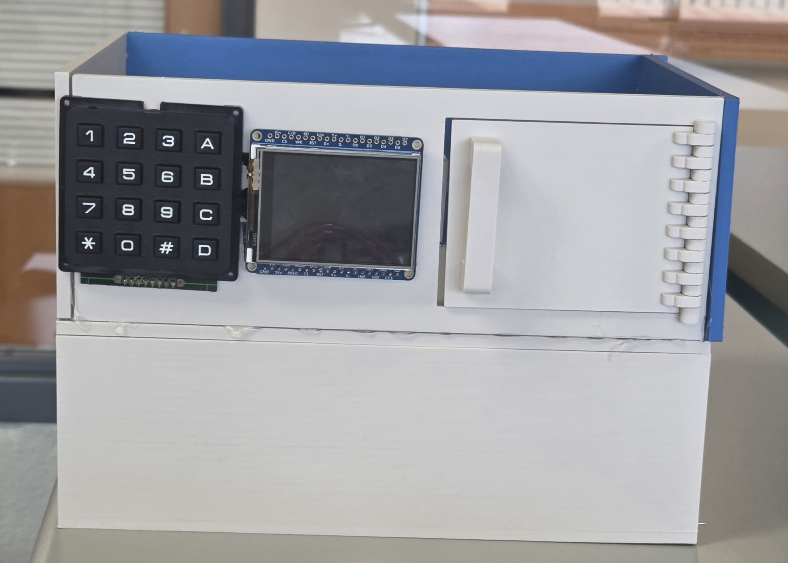

# Smart_Safe_Project
This Repository contains C code and diagrams for a Embedded System that provide affordable security system with Multi-factor Authentication and Real Time Monitoring achieved using Raspberry Pi Pico 2

